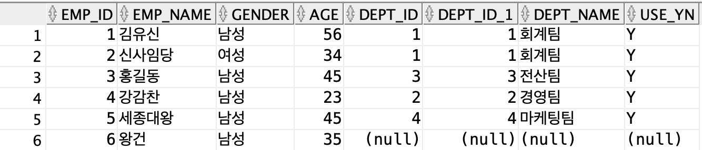
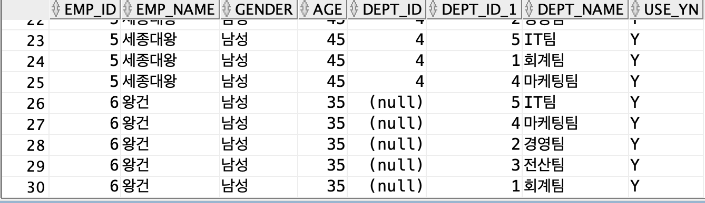

# 9장_조인

## 조인이란

> 테이블과의 관계를 맺는 방법
> 

### 선행조건

- 두 테이블 간 연결고리 역활을 할 컬럼

### DEFAULT

> 기본 값 설정
> 

## 내부 조인

### 내부 조인

> WHERE절 필요
> 

```sql
SELECT a.emp_id, a.emp_name, a.gender, a.age, a.dept_id,
       b.dept_id, b.dept_name, b.use_yn
  FROM emp_master a
      ,dept_master b
 WHERE a.dept_id = b.dept_id
 ORDER BY a.emp_id;
```

### 내부 조인_조건

> AND 연산자 필요
> 

```sql
SELECT a.emp_id, a.emp_name, a.gender, a.age, a.dept_id,
       b.dept_id, b.dept_name, b.use_yn
  FROM emp_master a
      ,dept_master b
 WHERE a.dept_id = b.dept_id
   AND a.gender = '남성'
 ORDER BY a.emp_id;
```

### 내부 조인_다중테이블

```sql
SELECT a.emp_id, a.emp_name, a.gender, a.age, 
       b.dept_id, b.dept_name, b.use_yn,
       c.address_id, c.city, c.gu, c.address_name
  FROM emp_master a
      ,dept_master b
      ,address_master c
 WHERE a.dept_id    = b.dept_id
   AND a.address_id = c.address_id
   AND a.gender     = '남성'
 ORDER BY a.emp_id;
```

---

### ANSI 내부 조인

> WHERE절 필요 X
> 
- 국제 표준

```sql
SELECT a.emp_id, a.emp_name, a.gender, a.age, a.dept_id,
       b.dept_id, b.dept_name, b.use_yn
  FROM emp_master a
INNER  JOIN dept_master b
    ON a.dept_id = b.dept_id
 ORDER BY a.emp_id;
```

### ANSI 내부 조인_조건

```sql
SELECT a.emp_id, a.emp_name, a.gender, a.age, a.dept_id,
       b.dept_id, b.dept_name, b.use_yn
  FROM emp_master a
INNER  JOIN dept_master b
    ON a.dept_id = b.dept_id
WHERE a.gender = '남성'
 ORDER BY a.emp_id;
```

### ANSI 내부 조인_다중테이블

```sql
SELECT a.emp_id, a.emp_name, a.gender, a.age, 
       b.dept_id, b.dept_name, b.use_yn,
       c.address_id, c.city, c.gu, c.address_name
  FROM emp_master a
 INNER JOIN dept_master b
    ON a.dept_id = b.dept_id
 INNER JOIN address_master c
    ON a.address_id = c.address_id
 WHERE a.gender = '남성'
 ORDER BY a.emp_id; 
```

## 외부 조인

> 내부 조인 -  두 테이블에서 조인 컬럼 값이 같은 것을 조회,
외부 조인 -  두 테이블 중 한 테이블의 조인 컬럼 값이 없더라도 없는건까지 모두 조회
> 

> 데이터 값
> 

```sql
INSERT INTO emp_master ( emp_id, emp_name, gender, age, hire_date, dept_id, address_id )
VALUES (6, '왕건', '남성', 35, TO_DATE('2018-01-01', 'YYYY-MM-DD'), NULL, 4);
```

> 외부 조인을 사용하여 dept_id 값이 일치하지 않아도 조회 가능
> 
- 내부 조인에 ( + ) 만 추가하면 된다.
    - 데이터가 없으니 추가로 가져오라는 뜻
    - 오라클에서만 사용

```sql
SELECT a.emp_id, a.emp_name, a.gender, a.age, a.dept_id,
       b.dept_id, b.dept_name, b.use_yn
  FROM emp_master a
      ,dept_master b
 WHERE a.dept_id = b.dept_id(+)
 ORDER BY a.emp_id;
```



### ANSI 외부 조인

> INNER 대신 LEFT 사용
> 
- 순서 중요

```sql
SELECT a.emp_id, a.emp_name, a.gender, a.age, a.dept_id,
       b.dept_id, b.dept_name, b.use_yn
  FROM emp_master a
  LEFT JOIN dept_master b
    ON a.dept_id = b.dept_id
 ORDER BY a.emp_id;
```

### 반대로

> ( + ) 위치 변경
> 

```sql
SELECT a.emp_id, a.emp_name, a.gender, a.age, a.dept_id,
       b.dept_id, b.dept_name, b.use_yn
  FROM emp_master a
      ,dept_master b
 WHERE a.dept_id(+) = b.dept_id
 ORDER BY a.emp_id;
```

> LEFT를 RIGHT로
> 

```sql
SELECT a.emp_id, a.emp_name, a.gender, a.age, a.dept_id,
       b.dept_id, b.dept_name, b.use_yn
  FROM emp_master a
 RIGHT JOIN dept_master b
    ON a.dept_id = b.dept_id
 ORDER BY a.emp_id;
```

### FULL OUTER JOIN

> 둘다 조회
> 
- OUTER 생략 가능

```sql
SELECT a.emp_id, a.emp_name, a.gender, a.age, a.dept_id,
       b.dept_id, b.dept_name, b.use_yn
  FROM emp_master a
  FULL OUTER JOIN dept_master b
    ON a.dept_id = b.dept_id
 ORDER BY a.emp_id;
```

<aside>
✅ 주로 내부 조인만 사용

</aside>

### 카티션 곱

> 조인 조건을 안주는 조인
> 
- 두 테이블의 데이터를 기준으로 가능한 모든 조합 조회

> 사원정보 테이블 로우가 6개, 부서정보 테이블 로우가 5개 이므로,
가능한 데이터 [6 * 5 = ] 30개의 데이터가 조회
> 

```sql
SELECT a.emp_id, a.emp_name, a.gender, a.age, a.dept_id,
       b.dept_id, b.dept_name, b.use_yn
  FROM emp_master a
      ,dept_master b
 ORDER BY a.emp_id;
```

