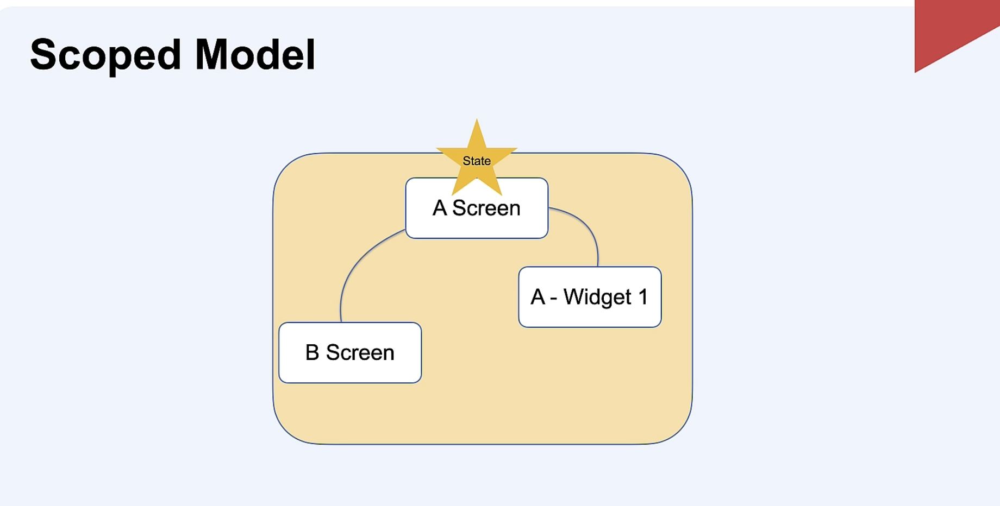
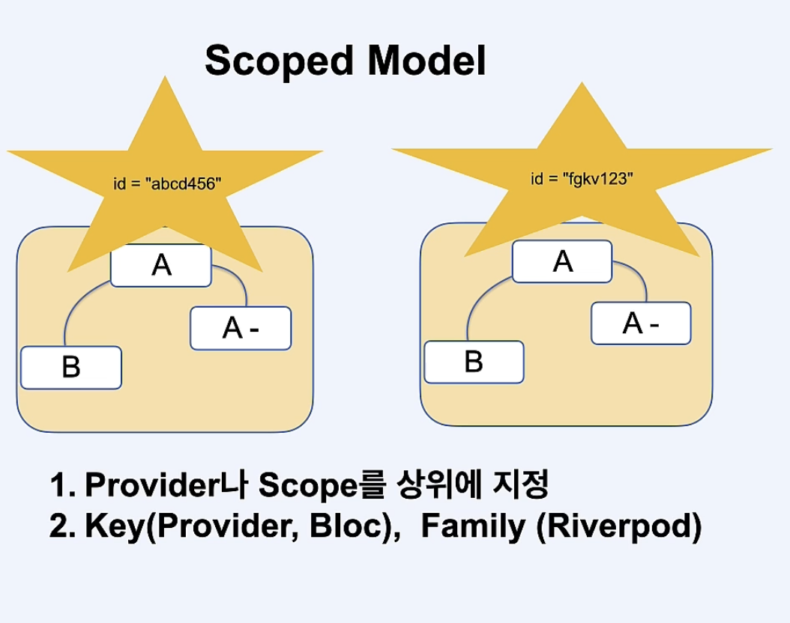
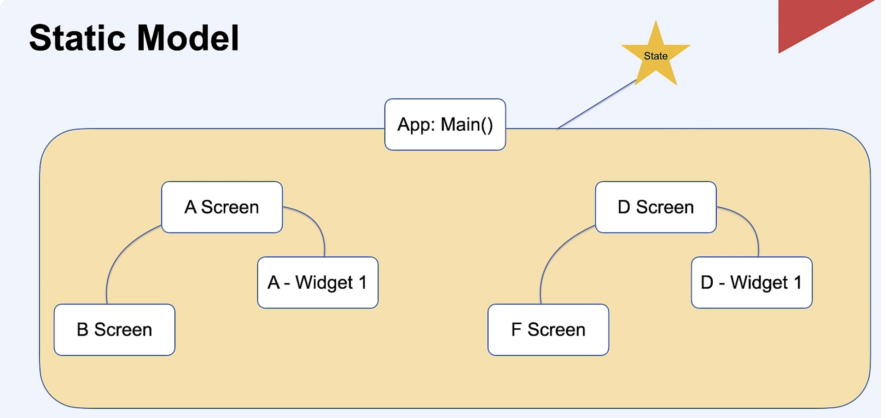
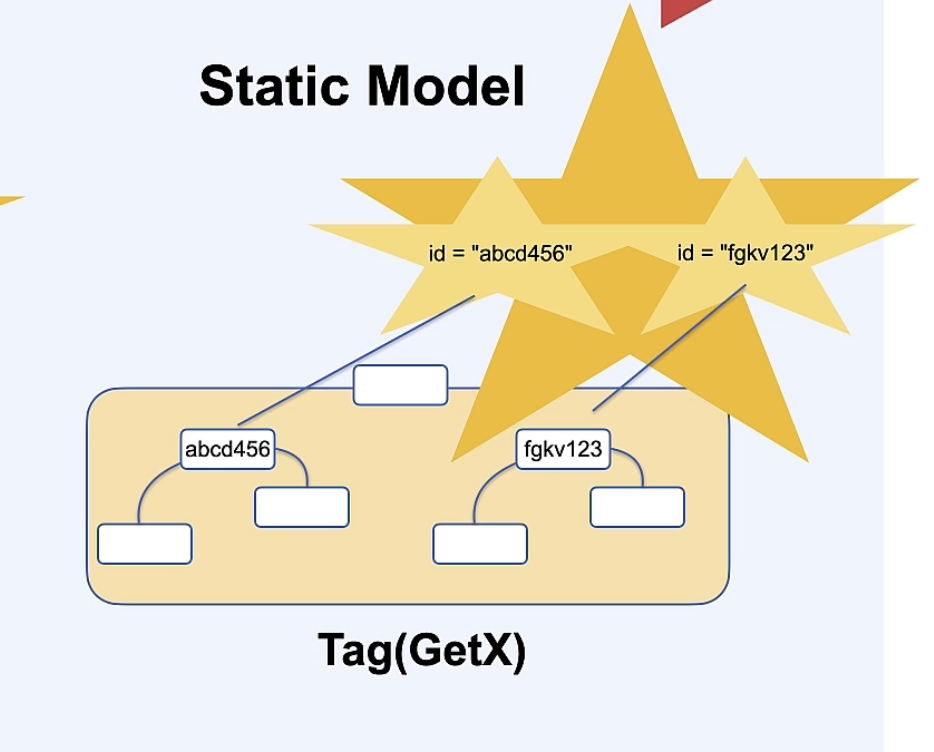

# State Management

## 배워야 하는 이유
1. 최초 개발을 빠르게
2. 앱 스펙이 수정되었을때 필요한 부분을 빠르게 찾고 수정하기 위해서

## Scoped Model

- 데이터를 사용할 수 있는 범위가 정해져있음
* 헤당 Scope 화면이 사라지면 자동으로 메모리 해제
* Child에서 데이터 참조를 할 때 id(구별자)없이도 상위 데이터 참조 가능

## StaticModel

- 어디서든 데이터에 접근 가능
* 메모리 관리를 개발자가 직접 관리
* Child에서 데이터를 참조 할때 id(구별자)가 항상 필요하다.
* Scope 모델보다 구현이 쉽다.
* 모든 코드에서 원하는 State에 접근하고 수정이 가능
* 외부 신호를 받을 때 구현하기 쉬움(GPS, 흔들기)

## 패키지들

* GetX
* river_pod
* bloc

