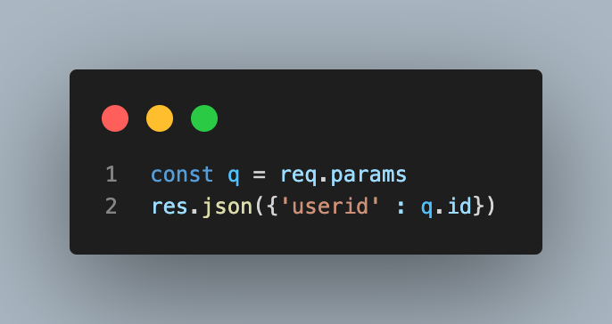

# Node.js

- 벡엔드 프레임워크
- 가장 많이 사용한다.

## express

### prot

서버에 들어가는 입구
- 각각의 포트가 정해져있다.
- 포트마다 다른 프로그램 실행 가능

### 라우팅

- 서버를 접속 할 때 / 뒤에 있는 문자들
- 포트마다 다른 라우팅을 지정 가능

### localhost

내 컴퓨터의 IP를 표시하지 않쓰고 사용할 수 있음

### HTTP 메소드

요청의 목적이나 종류를 알려주려고 사용하는 수단

Get - 주소창
Post - 주소창 X

### Get

get 호출시 html 태그도 같이 보낼 수 있다.

params, query

params
- 라우팅을 모두 해주는 것은 말이 안됨
- 변수로 받을 수 있다.
- `/user/:id` -> id 부분에 원하는 값을 받을 수 있고
- 출력시 `{id : 입력한 값}`으로 출력됨
![[Pasted image 20231101225419.png]]

#### query

- ? 뒤에 쿼리 값을 입력 가능
- &로 연결해 여러 값을 줄 수 있다.
- 키 값, 벨류 값 설정 가능

## API 서버 만들기

- {} 사용시 벨류 값 바로 출력 가능
![[Pasted image 20231101230126.png]]

## CORS 

- HTML 파일로 요청시 원래 오류가 뜬다.
- 요청 받는것을 통제할 수 있다.
- 비워두면 모든 요청 허용