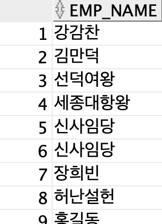
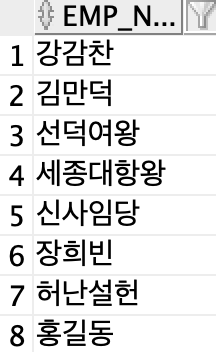
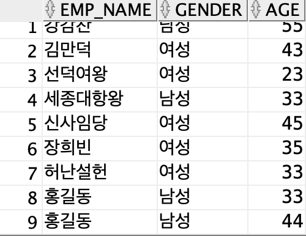

# 8장_집합 쿼리

## UNION ALL

> 합집합 - 중복값 허용
> 
- 컬럼 수와 데이터형이 일치해야함
- 컬럼 이름은 상관 없음 - 첫번째 SELEC 문의 컬럼 명을 기준으로 조회

```sql
SELECT emp_id, emp_name, gender, age
    FROM emp03
UNION ALL
SELECT emp_id2, emp_name2, gender, age
    FROM emp08;
```
<br/>
> ORDER BY 로 데이터 정렬시 맨 마지막에 작성
> 

```sql
SELECT emp_id, emp_name, gender, age
    FROM emp03
UNION ALL
SELECT emp_id2, emp_name2, gender, age
    FROM emp08
ORDER BY emp_id DESC;
```

## UNION

> 합집합 - 중복값 제거 
<br/>
> UNION ALL 사용


```sql
SELECT emp_name
    FROM emp03
UNION ALL
SELECT emp_name2
    FROM emp08
ORDER BY 1;
```


<br/>
> UNION 사용
> 

```sql
SELECT emp_name
    FROM emp03
UNION
SELECT emp_name2
    FROM emp08
ORDER BY 1;
```



<br/>
> 값이 다른 데이터가 포함될 경우 중복 X
> 

```sql
SELECT emp_name, gender, age
    FROM emp03
UNION
SELECT emp_name2, gender, age
    FROM emp08
ORDER BY 1;
```



## INTERSECT

> 교집합
> 

```sql
SELECT emp_name
    FROM emp03
INTERSECT
SELECT emp_name2
    FROM emp08
ORDER BY 1;

```

## MINUS

> 차집합
> 
- 첫번째 집에서 두번째 집합 빼기
- 순서가 중요하다

```sql
SELECT emp_name
    FROM emp03
MINUS
SELECT emp_name2
    FROM emp08
ORDER BY 1;
```